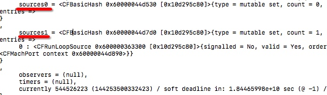
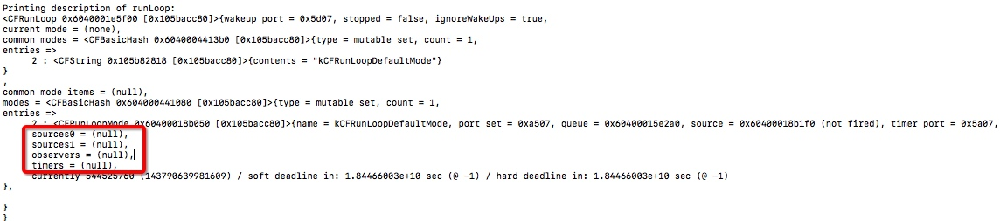

标题：常驻线程是一种什么体验
来源： http://www.veryitman.com/2018/04/21/%E5%B8%B8%E9%A9%BB%E7%BA%BF%E7%A8%8B%E6%98%AF%E4%B8%80%E7%A7%8D%E4%BB%80%E4%B9%88%E4%BD%93%E9%AA%8C/

## 简说 RunLoop

关于 iOS RunLoop 网上很多文章都有介绍过, 很多技术面试官也会问关于 RunLoop 的相关知识. 我把自己工作中遇到的问题和总结的经验分享出来(会做成一系列的文章), 也算是对自己的一个总结和沉淀, 欢迎大家交流.

网上的文章基本都是针对于 [Apple Developer Doc - Run Loops](https://developer.apple.com/library/content/documentation/Cocoa/Conceptual/Multithreading/RunLoopManagement/RunLoopManagement.html) 这篇来展开的, 所以建议大家认真的去通读这篇文章, 并写代码验证, 实践.

可以简单粗暴的这么理解一下 RunLoop, 基于事件驱动的死循环(由内核来调度和管理的), 在需要处理事情的时候就出来干点事, 否则休眠待命.
RunLoop 的核心是基于 `machport` 的，其进入休眠时调用的函数是 mach_msg().

类似下面的代码来说明一下:

```
BOOL stopRunning = NO;

do {
   
   // 处理 App 中各种操作各种事件
   // 点击屏幕, 触摸到硬件也会唤醒 RunLoop
   
  } while(!stopRunning);
```

说到这里, 随便提及一下, 学习过 Android 开发的同事应该和好理解 RunLoop 了, iOS 的 RunLoop 跟 Android 的 Looper 机制几乎一样, 只是不同的系统之间实现有差异罢了!

有兴趣的朋友可以看一下我之前写的文章 [Handler: 更新UI的方法](https://blog.csdn.net/veryitman/article/details/6384641).

------

今天跟大家分享如何在 iOS 中结合 RunLoop 和 machport 实现常驻线程, 先跟着实例走, 后续再去总结 RunLoop 的各种细节点.

## 神奇的 main

开发过 iOS 应用中的朋友, 对 `main.m` 再也熟悉不过了, `main` 函数正是应用的入口函数.

```
int main(int argc, char * argv[]) {
    @autoreleasepool {
        return UIApplicationMain(argc, argv, nil, NSStringFromClass([AppDelegate class]));
    }
}
```

我们将 `return` 代码分开写, 看看有什么蛛丝马迹可寻.

```
int main(int argc, char * argv[]) {
    
    @autoreleasepool {
        
        int ret = UIApplicationMain(argc, argv, nil, NSStringFromClass([AppDelegate class]));
        
        NSLog(@"veryitman--- UIApplicationMain end.");
        
        return ret;
    }
}
```

无论如何你也看不到日志 `veryitman--- UIApplicationMain end.` 的打印, 这说明 `UIApplicationMain` 一直在呵护着 APP 的运行, 哈哈.

我们不妨再改一次, 如下:

```
int main(int argc, char * argv[]) {
    
    @autoreleasepool {
        return 0;
    }
}
```

再去运行 APP, 你会发现根本没有让 APP 运行起来, 再次说明没有了 `UIApplicationMain` 的呵护, APP 无法起死回生.

猜测在 `UIApplicationMain` 函数中，开启了和主线程相关的 RunLoop，使 `UIApplicationMain` 不会返回一直在运行中，从而保证了程序的持续运行, 最大的功臣就是 RunLoop.

## 普通线程

一般我们开启的线程在执行完任务后, 就会结束该线程. 除非你写了类似下面的代码:

```
while(1) {
    // 业务处理
}
```

或者

```
while (条件满足) {
    // 业务处理
}
```

开启一个线程

```
- (NSThread *)permanentThread {
    
    static NSThread *thread = nil;
    static dispatch_once_t onceToken;
    dispatch_once(&onceToken, ^{

        thread = [[NSThread alloc] initWithTarget:self selector:@selector(asyncRun) object:nil];
        [thread setName:@"veryitman-thread"];
        
        // 同一个线程连续多次 start 会导致 crash
        [thread start];
    });
    
    return thread;
}
```

执行对应的 `asyncRun` 函数, 如下:

```
- (void)asyncRun {
    
    @autoreleasepool {
        
        NSLog(@"veryitman--asyncRun. Current Thread: %@", [NSThread currentThread]);
        
        // 执行其他逻辑
        //...
        
        NSLog(@"veryitman--asyncRun. End Run.");
    }
}
```

可以发现 `asyncRun` 很快就可以执行完成 (End Run).

```
veryitman--asyncRun. Current Thread: <NSThread: 0x60000066c400>{number = 3, name = veryitman-thread}
veryitman--asyncRun. End Run.
```

## 子线程开启 RunLoop

主线程是默认开启 RunLoop 的即 mainRunLoop 是系统默认开启的, 但是子线程中的 RunLoop 需要我们自己手动开启.

> 关于为什么子线程中需要手动开启, 后续文章结合源码给大家分析, 这里暂时可以理解为获取 RunLoop 对象是一种懒加载模式. 只不过主线程中, 系统帮我们开启了, 然而子线程中需要我们手动开启而已.

类似这样:

```
- (void)asyncRun {
    
    @autoreleasepool {
        
        NSLog(@"veryitman--asyncRun. Current Thread: %@", [NSThread currentThread]);
        
        NSRunLoop *runLoop = [NSRunLoop currentRunLoop];
        
        NSLog(@"veryitman--asyncRun. Current RunLoop: %@", runLoop);
        
        // 执行其他逻辑
        //...
        
        // 手动开启 RunLoop
        [runLoop run];
        
        NSLog(@"veryitman--asyncRun. End Run.");
    }
}
```

在控制台可以看到输出:

[](http://www.veryitman.com/upload/images/2018/04/21/1.jpg)

RunLoop 没有任何输入源(input source) 和定时器(timer), 这时即使开启了 RunLoop 也不会让其等待执行, 换句话说会立即结束当前的 RunLoop.

既然这样我们给子线程的 RunLoop 添加源或者定时器即可. 这里以添加 NSPort 为例.

```
- (void)asyncRun {
    
    @autoreleasepool {
        
        NSLog(@"veryitman--asyncRun. Current Thread: %@", [NSThread currentThread]);
        
        NSRunLoop *runLoop = [NSRunLoop currentRunLoop];
        
        // 添加 source
        NSPort *port = [NSMachPort port];
        [runLoop addPort:port forMode:NSRunLoopCommonModes];
               
        NSLog(@"veryitman--asyncRun. Current RunLoop: %@", runLoop);
        
        // 执行其他逻辑
        //...
        
        // 手动开启 RunLoop
        [runLoop run];
        
        NSLog(@"veryitman--asyncRun. End Run.");
    }
}
```

再次运行, 你会发现 `End Run` 这个 Log 是不会打印出来的. 对应当前的 RunLoop 也有了源和定时器, 如图所示:
[](http://www.veryitman.com/upload/images/2018/04/21/2.jpg)

关于定时器和 RunLoop 的结合, 下篇再分享.

现在有这样一个需求, 需要在指定的线程中执行某项任务, 显然使用上面的方法来满足需求, 下面进入今天的正题.

## 验证常驻线程

一定到 `常驻` 这个词, 就知道是能够让该线程随时待命, 保证其不挂掉.

iOS 中默认就有个主线程即 `main 线程`, 我们的 UI 线程指的就是主线程, 一般都是在主线程中操作 UI, 从某个角度来说, 主线程就是一个常驻线程.

我们开启其他线程, 目的是为了异步完成一些任务, 这些任务一般都比较耗时, 如果放在主线程当中完成这些任务就会导致主线程的卡顿, 用户体验极其差.

说了这么多, 也许你会问, 为什么要常驻线程呢?

频繁的创建和销毁线程，会造成资源(主要是内存)的浪费, 我们为什么不让频繁使用的子线程常驻在内存中, 想用的时候就用, 不用的时候让他休眠呢?!

上面已经使用 RunLoop 来实现了让线程长时间存活而不被销毁了.

用 `touchesBegan` 来模拟在指定线程中再次执行任务(runAnyTime)的方法.

```
- (void)touchesBegan:(NSSet<UITouch *> *)touches withEvent:(UIEvent *)event {
    
    // 模拟在指定线程上面再次执行方法
    SEL seltor = NSSelectorFromString(@"runAnyTime");
    [self performSelector:seltor onThread:[self permanentThread] withObject:nil waitUntilDone:NO];
}

- (void)runAnyTime {
    
    NSLog(@"veryitman--runAnyTime. Current Thread: %@", [NSThread currentThread]);
}
```

对应上面的 `asyncRun` 实现即可, 你会发现在当前页面每次点击屏幕都会执行 `runAnyTime`.

## 附录

代码的完整实现

> 常驻线程, 可以参考具体的注释.

**MZCreatePermanentThreadController.m**

```
@implementation MZCreatePermanentThreadController

- (void)dealloc {
    
    NSLog(@"veryitman---MZCreatePermanentThreadController dealloc.");
}

- (void)viewDidLoad {
    
    [super viewDidLoad];
    
    self.view.backgroundColor = [UIColor lightGrayColor];
    self.navigationItem.title = @"创建常驻线程";
    
    // 启动线程
    [self permanentThread];
}

- (void)viewDidDisappear:(BOOL)animated {
    
    [super viewDidDisappear:animated];
    
    // 取消线程
    // 实际业务场景中自行决定 canCancel 的设置, 这里只是示例
    BOOL canCancel = YES;
    if (canCancel) {
        [[self permanentThread] cancel];
    }
}

- (void)touchesBegan:(NSSet<UITouch *> *)touches withEvent:(UIEvent *)event {
    
    // 模拟在指定线程上面再次执行方法
    SEL seltor = NSSelectorFromString(@"runAnyTime");
    
    [self performSelector:seltor onThread:[self permanentThread] withObject:nil waitUntilDone:NO];
}

- (NSThread *)permanentThread {
    
    static NSThread *thread = nil;
    static dispatch_once_t onceToken;
    dispatch_once(&onceToken, ^{

        thread = [[NSThread alloc] initWithTarget:self selector:@selector(asyncRun) object:nil];
        [thread setName:@"veryitman-thread"];
        
        // 同一个线程连续多次 start 会导致 crash
        [thread start];
    });
    
    return thread;
}

- (void)asyncRun {
    
    @autoreleasepool {
        
        NSLog(@"veryitman--asyncRun. Current Thread: %@", [NSThread currentThread]);
        
        NSRunLoop *runLoop = [NSRunLoop currentRunLoop];
        
        // 添加 source
        NSPort *port = [NSMachPort port];
        [runLoop addPort:port forMode:NSRunLoopCommonModes];
        
        NSLog(@"veryitman--asyncRun. Current RunLoop: %@", runLoop);
        
        // 执行其他逻辑
        //...
        
        // 手动开启 RunLoop
        [runLoop run];
        
        NSLog(@"veryitman--asyncRun. End Run.");
    }
}

- (void)runAnyTime {
    
    NSLog(@"veryitman--runAnyTime. Current Thread: %@", [NSThread currentThread]);
}
```

## 参考文档

[Toll-Free Bridging](https://developer.apple.com/library/content/documentation/General/Conceptual/CocoaEncyclopedia/Toll-FreeBridgin/Toll-FreeBridgin.html)

[Run Loops](https://developer.apple.com/library/content/documentation/Cocoa/Conceptual/Multithreading/RunLoopManagement/RunLoopManagement.html)