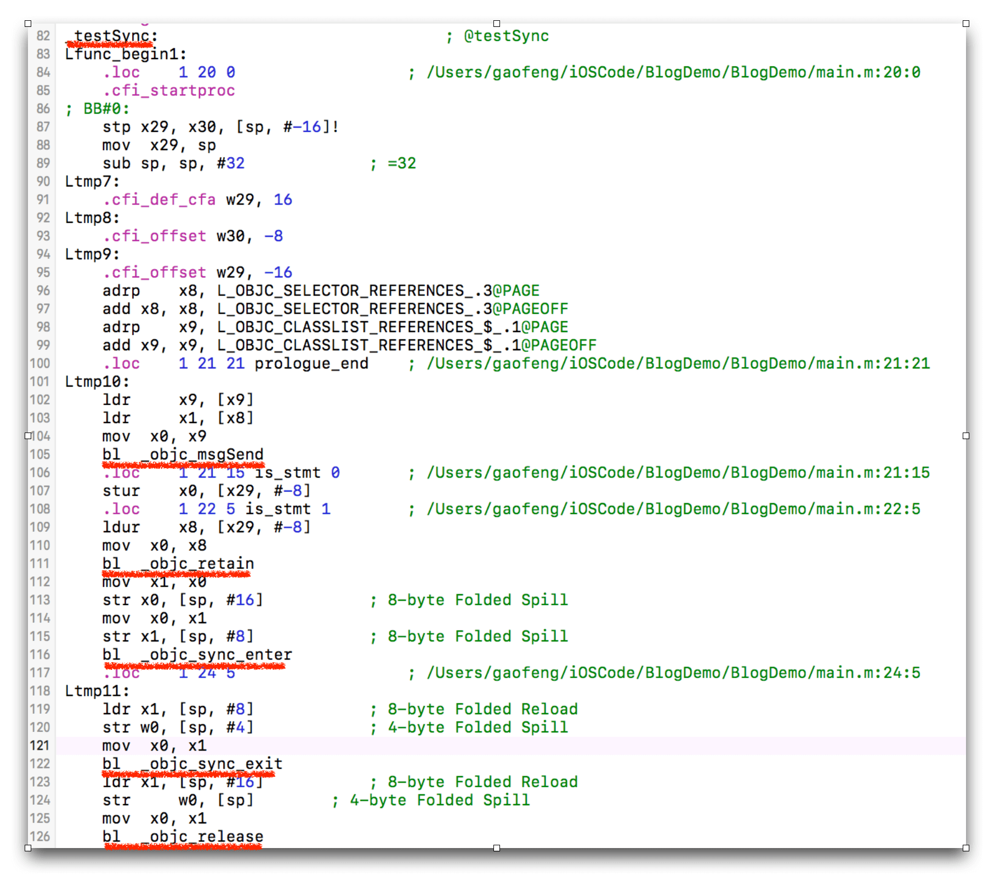

# 正确使用多线程同步锁@synchronized()

在上篇多线程安全的文章中，我曾推荐过大家使用@synchronized来使得代码获得原子性，从而保证多线程安全。这篇文章向大家介绍一些@synchronized的知识点和应该避免的坑。

### @synchronized原理

@synchronized是几种iOS多线程同步机制中最慢的一个，同时也是最方便的一个。

苹果建立@synchronized的初衷就是方便开发者快速的实现代码同步，语法如下：

```
@synchronized(obj) {
  //code
}
```

为了加深理解，我们刨一刨代码看看@synchronized到底做了什么事。我在一个测试工程的main.m中写了一段代码：

```
void testSync()
{
    NSObject* obj = [NSObject new];
    @synchronized (obj) {
        
    }
}
```

然后在Xcode中选择菜单Product->Perform Action->Assemble “main.m”，就得到了如下的汇编代码：



上图中我将关键代码用红线标出了，很容易就定位到了我们的目标代码。

ARC帮我们插入的retain，release也在其中:)，我们感兴趣的部分是下面两个函数：

```
bl	_objc_sync_enter
bl	_objc_sync_exit
```

这两个函数应该就是synchronized进入和退出的调用，下面去Objective C的源码里找找 :)

在源码中一搜，很快就发现了这两个函数：

```c
// Begin synchronizing on 'obj'. 
// Allocates recursive mutex associated with 'obj' if needed.
// Returns OBJC_SYNC_SUCCESS once lock is acquired.  
int objc_sync_enter(id obj)
{
    int result = OBJC_SYNC_SUCCESS;

    if (obj) {
        SyncData* data = id2data(obj, ACQUIRE);
        assert(data);
        data->mutex.lock();
    } else {
        // @synchronized(nil) does nothing
        if (DebugNilSync) {
            _objc_inform("NIL SYNC DEBUG: @synchronized(nil); set a breakpoint on objc_sync_nil to debug");
        }
        objc_sync_nil();
    }

    return result;
}


// End synchronizing on 'obj'. 
// Returns OBJC_SYNC_SUCCESS or OBJC_SYNC_NOT_OWNING_THREAD_ERROR
int objc_sync_exit(id obj)
{
    int result = OBJC_SYNC_SUCCESS;
    
    if (obj) {
        SyncData* data = id2data(obj, RELEASE); 
        if (!data) {
            result = OBJC_SYNC_NOT_OWNING_THREAD_ERROR;
        } else {
            bool okay = data->mutex.tryUnlock();
            if (!okay) {
                result = OBJC_SYNC_NOT_OWNING_THREAD_ERROR;
            }
        }
    } else {
        // @synchronized(nil) does nothing
    }
	
    return result;
}
```

从上述源码中，我们至少可以确立两个信息：

- **synchronized是使用的递归mutex来做同步。**
- **@synchronized(nil)不起任何作用**

递归mutex的意思是，我们可以写如下代码：

```
@synchronized (obj) {
    NSLog(@"1st sync");
    @synchronized (obj) {
        NSLog(@"2nd sync");
    }
}
```

而不会导致死锁。我顺道扒了下java当中的synchronized关键字，发现也是使用的递归锁，看来这是个common trick。recursive mutex其实里面还是使用了pthread_mutex_t，只不过多了一层ownership的判断，性能上比非递归锁要稍微慢一些。

@synchronized(nil)不起任何作用，表明我们需要适当关注传入的object的声明周期，一旦置为nil之后就无法做代码同步了。

**我们再看看传入的obj参数有什么作用**。

继续看代码发现传入的obj被用作参数来获取SyncData对象，里面有一大段关于SyncData的cache逻辑，有兴趣的同学可以自己看下代码，这是一个两层的cache设计，第一层是tls cache，第二层是自己维护的一个hash map。这里将流程简化，来看下obj是如何在hash map中缓存的。

先看下SyncData获取的方式：

```
SyncData **listp = &LIST_FOR_OBJ(object);
```

而LIST_FOR_OBJ又指向：

```
#define LIST_FOR_OBJ(obj) sDataLists[obj].data
static StripedMap<SyncList> sDataLists;
```

再看下StripedMap的实现就很清楚了：

```
static unsigned int indexForPointer(const void *p) {
    uintptr_t addr = reinterpret_cast<uintptr_t>(p);
    return ((addr >> 4) ^ (addr >> 9)) % StripeCount;
}

public:
T& operator[] (const void *p) { 
    return array[indexForPointer(p)].value; 
}
```

indexForPointer中使用了obj的内存地址，做了个简单的map，映射到另一个内存空间来存放SyncList。

通过上述分析，我们可以得出结论了：

**synchronized中传入的object的内存地址，被用作key，通过hash map对应的一个系统维护的递归锁。**

以上就是object的用处，所以不管是传入什么类型的object，只要是有内存地址，就能启动同步代码块的效果。

消化完synchronized的内部实现，我们再来看看平常使用中常见的一些坑。

### 慎用@synchronized(self)

我其实更想说：不要使用@synchronized(self)。

我看过不少代码都是直接将self传入@synchronized当中，这是种很粗糙的使用方式，容易导致死锁的出现。比如：

```
//class A
@synchronized (self) {
    [_sharedLock lock];
    NSLog(@"code in class A");
    [_sharedLock unlock];
}

//class B
[_sharedLock lock];
@synchronized (objectA) {
    NSLog(@"code in class B");
}
[_sharedLock unlock];
```

原因是因为self很可能会被外部对象访问，被用作key来生成一锁，类似上述代码中的`@synchronized (objectA)`。两个公共锁交替使用的场景就容易出现死锁。

所以正确的做法是传入一个类内部维护的NSObject对象，而且这个对象是对外不可见的。

### 精准的粒度控制

有些人说@synchronized慢，但@synchronized和其他同步锁的性能相比并没有很夸张，对于使用者来说几乎忽略不计。

之所以慢是更多的因为没有做好粒度控制。锁本质上是为了让我们的一段代码获得原子性，不同的critical section要使用不同的锁。我见过很多类似的写法：

```
@synchronized (sharedToken) {
    [arrA addObject:obj];
}

@synchronized (sharedToken) {
    [arrB addObject:obj];
}
```

使用同一个token来同步arrA和arrB的访问，虽然arrA和arrB之间没有任何联系。传入self的就更不对了。

应该是不同的数据使用不同的锁，尽量将粒度控制在最细的程度。上述代码应该是：

```
@synchronized (tokenA) {
    [arrA addObject:obj];
}

@synchronized (tokenB) {
    [arrB addObject:obj];
}
```

### 注意内部的函数调用

@synchronized还有个很容易变慢的场景，就是{}内部有其他隐蔽的函数调用。比如：

```
@synchronized (tokenA) {
    [arrA addObject:obj];
    [self doSomethingWithA:arrA];
}
```

doSomethingWithA内部可能又调用了其他函数，维护doSomethingWithA的工程师可能并没有意识到自己是被锁同步的，由此层层叠叠可能引入更多的函数调用，代码就莫名其妙的越来越慢了，感觉锁的性能差，其实是我们没用好。

所以在书写@synchronized内部代码的时候，要十分小心内部隐蔽的函数调用。

[来源](http://mrpeak.cn/blog/synchronized/)
