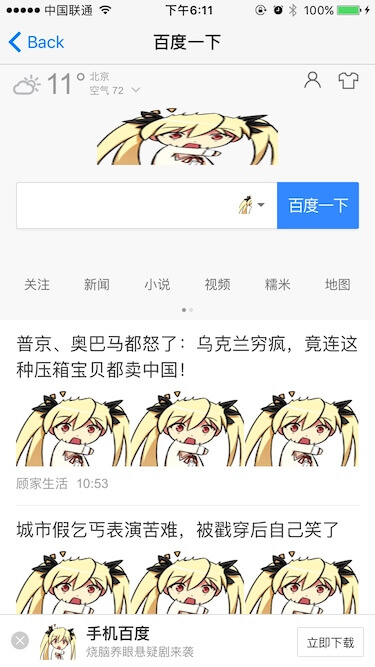

# 让 WKWebView 支持 NSURLProtocol

最近把公司的项目从 UIWebView 迁移到了 WKWebView，因为之前大体上还是遵从了 Apple 的 API 没有过度地去 hack，而且 [WebViewJavascriptBridge](https://github.com/marcuswestin/WebViewJavascriptBridge) 也同样支持 WKWebView，所以迁移过程没有想象中那么痛苦，只要把 UIWebViewDelegate 的方法改成 WKUIDelegate 和 WKNavigationDelegate 对应方法就好了。


但是在 WKWebView 已经出现了三年的今天，UIWebView 还没有被标记为 deprecated，我想 Apple 一定也和很多开发者一样，觉得 WKWebView 还没有完善到能完全替代 UIWebView 的程度。比如其中一个痛点——对请求拦截的支持，正常情况下，按照下面的方式注册一个 NSURLProtocol 子类，就可以对 app 内所有的网络请求进行 [MitM](https://en.wikipedia.org/wiki/Man-in-the-middle_attack) 了：

```
[NSURLProtocol registerClass:[AwesomeURLProtocol class]];
```

但 WKWebView 中的请求却完全不遵从这一规则，除了一开始会调用一下 `+ [NSURLProtocol canInitWithRequest:]` 方法，之后的整个请求流程似乎就与 NSURLProtocol 完全无关了。关于这一点，网络上文章一般都解释说 WKWebView 的请求是在单独的进程里，所以不走 NSURLProtocol。

既然 WKWebView 不走 NSURLProtocol，那为什么还要在一开始调一下 `canInitWithRequest:` 呢？更令我好奇的是从 WebKit.framework dump 出的头文件能看出，有几个类（[WKCustomProtocol](https://github.com/JaviSoto/iOS10-Runtime-Headers/blob/master/Frameworks/WebKit.framework/WKCustomProtocol.h)、[WKCustomProtocolLoader](https://github.com/JaviSoto/iOS10-Runtime-Headers/blob/master/Frameworks/WebKit.framework/WKCustomProtocolLoader.h)）明显与 NSURLProtocol 有关，说明 WKWebView 很可能是支持 NSURLProtocol 的，只是出于某种原因没开放而已，于是我决定翻 WebKit 的[源码](https://github.com/WebKit/webkit)一探究竟。

## WKBrowsingContextController

翻 WebKit 源码的过程就不细说了，光从 GitHub 上拉源码到本地就花了我几个 G 的 ss 流量……总之翻到最后，我在一项单元测试 [TestProtocol.mm](https://github.com/WebKit/webkit/blob/master/Tools/TestWebKitAPI/cocoa/TestProtocol.mm) 中看到了 NSURLProtocol 熟悉的身影：

```
+ (void)registerWithScheme:(NSString *)scheme
{
    testScheme = [scheme retain];
    [NSURLProtocol registerClass:[self class]];
#if WK_API_ENABLED
    [WKBrowsingContextController registerSchemeForCustomProtocol:testScheme];
#endif
}
```

从 `registerSchemeForCustomProtocol:` 这个方法名来猜测，它的作用的应该是注册一个自定义的 scheme，这样对于 WebKit 进程的所有网络请求，都会先检查是否有匹配的 scheme，有的话再走主进程的 NSURLProtocol 这一套流程，猜测这么做可能是为了保证效率 (NSURLRequest 的 HTTPBody 属性在 WKWebView 中被忽略了应该也出于这个原因)，毕竟 IPC 代价挺高的。后续翻 `WebKit::CustomProtocolManager` 和 `WebKit::WebProcessPool` 等相关源码也印证了这个猜想。

看上去没什么问题，于是按照 TestCase 里的例子尝试了一下：

```
Class cls = NSClassFromString(@"WKBrowsingContextController");
SEL sel = NSSelectorFromString(@"registerSchemeForCustomProtocol:");
if ([(id)cls respondsToSelector:sel]) {
    // 把 http 和 https 请求交给 NSURLProtocol 处理
    [(id)cls performSelector:sel withObject:@"http"];
    [(id)cls performSelector:sel withObject:@"https"];
}

// 这下 AwesomeURLProtocol 就可以用啦
[NSURLProtocol registerClass:[AwesomeURLProtocol class]];
```

现在 WKWebView 中的所有请求都可以被 NSURLProtocol 修改了：


## 关于私有 API

按照 @sunnyxx 的[总结](http://blog.sunnyxx.com/2015/06/07/fullscreen-pop-gesture/)，Apple 检查私有 API 的使用，大概会采取下面几种手段：

- 是否 link 了私有 framework 或者公开 framework 中的私有符号，这可以防止开发者把私有 header 都 dump 出来供程序直接调用。
- 同上，使用@selector(_private_sel)加上-performSelector:的方式直接调用私有 API。
- 扫描所有符号，查看是否有继承自私有类，重载私有方法，方法名是否有重合。
- 扫描所有string，看字符串常量段是否出现和私有 API 对应的。

而本文所介绍的方法，一共有两个地方使用了私有 API：

```
Class cls = NSClassFromString(@"WKBrowsingContextController");
SEL sel = NSSelectorFromString(@"registerSchemeForCustomProtocol:");
```

这两个地方都是通过反射的方式拿到了私有的 class/selector，对应上面的第四条。其中第二行那个还好说，因为 `registerSchemeForCustomProtocol` 这个名词看上去相当普通，如果把这种字符串也禁掉了的话会误伤一大票开发者，所以有风险的主要是 `WKBrowsingContextController` 这个字符串，要前缀有前缀，要 camel case 有 camel case，再跟私有 class 名撞车的话就跟可能被拒了。

那么怎样绕过这个字符串呢？查询 [WKWebView.h](https://github.com/JaviSoto/iOS10-Runtime-Headers/blob/master/Frameworks/WebKit.framework/WKWebView.h) 可以看到，有个方法 `- browsingContextController` 的方法名跟 `WKBrowsingContextController` 长得很像，通过 KVC 取出来（没错，KVC 不但可以取 property 取 ivar，还可以取无入参 selector 的返回值）发现它就是 `WKBrowsingContextController` 的一个实例，这样一来这个私有类就可以通过 KVC 的方式来得到了：

```
Class cls = [[[WKWebView new] valueForKey:@"browsingContextController"] class];
```

比起粗暴地 `NSClassFromString`，使用 `valueForKey` 的方法安全了许多。当然，如果还有什么要担心的话，这些字符串也可以不明着写出来，只要运行时算出来就行，比如用 base64 编码啊，图片资源里藏一段啊，甚至通过服务器下发……既然到了这个程度，苹果的静态扫描就很难再 hold 住了。

使用私有 API 的另一风险是兼容性问题，比如上面的 `browsingContextController` 就只能在 iOS 8.4 以后才能用，反注册 scheme 的方法 `unregisterSchemeForCustomProtocol:` 也是在 iOS 8.4 以后才被添加进来的，要支持 iOS 8.0 ~ 8.3 机型的话，只能通过动态生成字符串的方式拿到 WKBrowsingContextController，而且还不能反注册，不过这些问题都不大。至于向后兼容，这个也不用太担心，因为 iOS 发布新版本之前都会有开发者预览版的，那个时候再测一下也不迟。对于本文的例子来说，如果将来哪个 iOS 版本移除了这个 API，那很可能是因为官方提供了完整的解决方案，到那时候自然也不需要本文介绍的方法了。

最后，我写了一个 Demo 放到了 GitHub 上，支持 iOS 8.4+，代码经测试已通过 App Store 审核：
https://github.com/yeatse/NSURLProtocol-WebKitSupport