iOS单元测试和UI测试教程

了解如何在iOS应用中添加单元测试和UI测试，以及如何检查代码覆盖率，[这是原文](https://www.raywenderlich.com/960290-ios-unit-testing-and-ui-testing-tutorial#toc-anchor-013)

编写测试并不迷人，但是测试可以防止您的闪亮的App变成bug缠身的垃圾，所以这是必要的。如果您正在阅读本教程，应该已经知道*应该*为代码和UI编写测试，但是可能不知道如何做。

您可能有一个*正在运行的App，但是您想测试为扩展该App所做的更改。也许您已经编写了测试，但是不确定它们是否是*正确的*测试。或者，您已经开始开发新的App，并且想随身进行测试。

本教程将向您展示：

- 如何使用Xcode的Test导航器来测试App的模型和异步方法
- 如何使用存根和模拟（stubs and mocks）来伪造与库或系统对象的交互
- 如何测试UI和性能
- 如何使用代码覆盖率工具

在此过程中，您将掌握测试大神（ninjas）所使用的一些词汇。

## 弄清楚你丫要测什么

在编写任何测试之前，了解基础知识是很重要的，你需要测试什么？

如果您的目标是扩展现有App，则应首先为计划更改的任何组件编写测试。

通常，测试应涵盖：

- 核心功能：模型类和方法及其与控制器的交互
- 最常见的UI工作流程
- 边界条件
- Bug修复

### 怎样测试最棒呢

First 这个缩写描述了一套有效单元测试的简明标准。这些标准是:

- *Fast*: 测试应该快速运行。
- *Independent/Isolated*: 测试不应相互共享状态。
- *Repeatable*:每次运行测试时都应该获得相同的结果。 外部数据提供程序或并发性问题可能会导致间歇性故障。
- *Self-validating*: 测试应完全自动化。 输出应该是“通过”或“失败”，而不是依赖于程序员对日志文件的解释。
- *Timely*: 理想情况下，应该在编写要测试的生产代码之前编写测试（测试驱动开发）。

遵循 FIRST 原则将保持您的测试清晰和有用，而不是成为您的App的障碍。

## 开始搞起吧

首先使用本教程顶部或底部的“下载材料”按钮下载项目材料。 有两个单独的入门项目：BullsEye和HalfTunes。

- *BullsEye*基于[*iOS Apprentice中*](https://store.raywenderlich.com/products/ios-apprentice)的示例App。游戏逻辑在该`BullsEyeGame`课程中，您将在本教程中对其进行测试。
- *HalfTunes*是[URLSession教程中](https://www.raywenderlich.com/110458/nsurlsession-tutorial-getting-started)示例App的更新版本。用户可以在iTunes API中查询歌曲，然后下载并播放歌曲片段。

说人话！
*BullsEye*是一个这样的游戏，我给你一个随机的进度条，你看进度条猜百分比，或者给你一个随机的百分比你滑动进度条到这个百分比，越接近目标值（targetValue）分数越高，打开工程玩一下就知道了

## Xcode中的单元测试

 *Test navigator* 提供与测试工作的最简单的方法; 您将使用它来创建测试目标并针对您的应用运行测试。

### 创建单元测试目标

打开*BullsEye*项目，然后按*Command+6*打开Test导航器。

单击左下角的*+*按钮，然后从菜单中选择*New Unit Test Target…*：

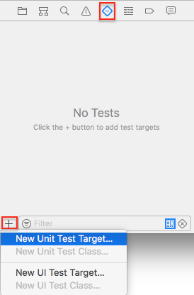

接受默认名称 *BullsEyeTests* 。 当 *Test bundle* 出现在 Test 导航器中时，单击以在编辑器中打开该 bundle。 如果包没有自动出现，请单击其他导航器之一进行故障排除，然后返回到 Test 导航器。

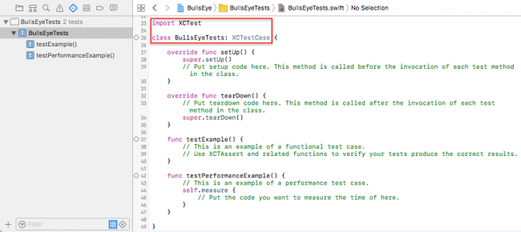

默认的模板导入测试框架，*XCTest*，并定义一个`BullsEyeTests`继承`XCTestCase`，用`setUp()`，`tearDown()`以及testExample测试方法。

有三种运行测试的方法：

1. *Product ▸ Test* 或 *Command-U*. 这两个都运行*全部的*测试类。
2. 单击“测试”导航器中的箭头按钮。
3. 单击装订线中的菱形按钮。

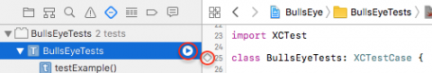

您也可以通过单击“测试”导航器或装订线中的菱形，运行单个测试方法。

尝试不同的方式运行测试，以了解所需的时间和外观。样本测试还没有做任何事情，因此它们运行得非常快！

当所有测试成功时，菱形将变为绿色并显示选中标记。您可以单击末尾的灰色菱形`testPerformanceExample()`以打开性能结果：

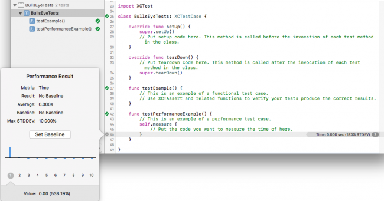

本教程不需要`testPerformanceExample()`或 `testExample()` ，因此删除它们。

### 使用XCTAssert测试模型

首先，您将使用`XCTAssert`函数来测试BullsEye模型的核心功能：`BullsEyeGame`对象是否正确计算出回合的分数？

在*BullsEyeTests.swift中*，在`import`语句下面添加以下行：

```swift
@testable import BullsEye
```

这使单元测试可以访问BullsEye中的*内部*类型和函数。

在`BullsEyeTests`类的顶部，添加以下属性：

```swift
var sut: BullsEyeGame!
```

这将为`BullsEyeGame`创建一个占位符，它是 *System Under Test* (SUT) ，或者是这个测试用例类与测试有关的对象。

接下来，将`setup()`内容替换为：

```swift
super.setUp()
sut = BullsEyeGame()
sut.startNewGame()
```

这将在类级别创建一个‘ BullsEyeGame’对象，因此此测试类中的所有测试都可以访问 SUT 对象的属性和方法。

在这里，您还调用了游戏的`startNewGame()`，它会初始化`targetValue`。许多测试将`targetValue`用来测试游戏是否正确计算了分数。

不要忘了在`tearDown()`中*释放*您的SUT对象。将其内容替换为：

```swift
sut = nil
super.tearDown()
```

*注意*：好的做法是在`setUp()`中创建SUT 并将其在`tearDown()`释放，以确保每次测试均以干净的状态开始。有关更多讨论，请查看[Jon Reid](http://qualitycoding.org/teardown/)关于该主题[的帖子](http://qualitycoding.org/teardown/)。

## 编写您的第一个测试

现在，您准备编写第一个测试！

将以下代码添加到`BullsEyeTests`的末尾：

```swift
func testScoreIsComputed() {
  // 1. given
  let guess = sut.targetValue + 5

  // 2. when
  sut.check(guess: guess)

  // 3. then
  XCTAssertEqual(sut.scoreRound, 95, "Score computed from guess is wrong")
}
```

测试方法的名称始终以*test*开头，然后是对其进行测试的描述。

良好的做法是将测试格式化为 *given*, *when* and *then* 部分:

1. *Given*: 在这里，您可以设置所需的任何值。在此示例中，您将创建一个`guess`值，以便可以指定与`targetValue`的差异。
2. *When*: 在本部分中，您将执行被测试的代码：调用`check(guess:)`。
3. *Then*: 这是您将在此部分中声明期望结果的部分，并在测试*失败时显示*一条消息。在这种情况下，`sut.scoreRound`应等于95（100 – 5）。

单击装订线或“测试”导航器中的菱形图标，运行测试。这将构建并运行该App，菱形图标将变为绿色的选中标记！

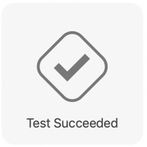

*注意*：要查看*XCTestAssertions*的完整列表，请转到 [Apple’s Assertions Listed by Category](https://developer.apple.com/documentation/xctest#2870839).

### 调试一个 Test

有一个`BullsEyeGame`故意内置的错误，你现在就可以练习找到它。 要查看 bug 的运行情况，您需要创建一个测试，该测试在*given*部分的`targetValue`中*减去* 5 ，其他所有内容保持不变。

```swift
func testScoreIsComputedWhenGuessLTTarget() {
  // 1. given
  let guess = sut.targetValue - 5

  // 2. when
  sut.check(guess: guess)

  // 3. then
  XCTAssertEqual(sut.scoreRound, 95, "Score computed from guess is wrong")
}
```

`guess`和`targetValue`之间的差仍为5，因此分数仍应为95。

在Breakpoint导航器中，添加*Test Failure Breakpoint*。当测试方法发布故障断言时，这将停止测试运行。

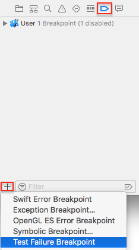

运行测试，它应该在`XCTAssertEqual`这一行即测试失败的情况下停止。

在调试控制台中检查`sut`和`guess`：

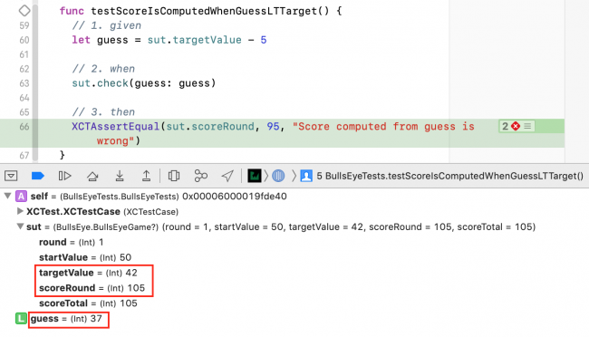

`guess`是`targetValue - 5`但是`scoreRound`是105，而不是95！

为了进一步研究，使用正常的调试过程： 在 *when* statement 和 *BullsEyeGame.swift*各设置一个断点, 在 `check(guess:)`里面, 创建 `difference`的地方. 
然后再次运行测试，并通过`let difference`语句检查App中`difference`的值：

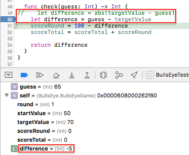


问题出在`difference`是负数，所以得分是*100 –（-5）*。为了解决这个问题，你应该在`check(guess:)`中使用`difference`的*绝对值*，取消注释正确的行并删除不正确的行。

删除两个断点，然后再次运行测试以确认现在可以成功。

### 使用XCTestExpectation测试异步操作

既然您已经了解了如何测试模型和调试 test failures，那么现在该继续测试异步代码了。

打开*HalfTunes*项目。它用于`URLSession`查询iTunes API和下载歌曲样本。假设您想对其进行修改以使用[AlamoFire](https://www.raywenderlich.com/121540/alamofire-tutorial-getting-started)进行网络操作。要查看是否有任何中断，您应该为网络操作编写测试，并在更改代码之前和之后运行它们。
`URLSession`方法是*异步的*：它们立即返回，但是要晚点再运行。要测试异步方法，您使用`XCTestExpectation`来让你的测试等待异步操作完成。

异步测试通常很慢，因此您应该将它们与更快的单元测试分开。

创建一个名为*HalfTunesSlowTests*的新单元测试目标。打开`HalfTunesSlowTests`类，然后在现有`import`语句下面导入HalfTunes app模块：

```swift
@testable import HalfTunes
```

此类中的所有测试都使用默认值`URLSession`将请求发送到Apple的服务器，因此声明一个`sut`对象，然后在`setUp()`中创建它，在`tearDown()`释放它。

将`HalfTunesSlowTests`类的内容替换为：

```swift
var sut: URLSession!

override func setUp() {
  super.setUp()
  sut = URLSession(configuration: .default)
}

override func tearDown() {
  sut = nil
  super.tearDown()
}
```

接下来，添加此异步测试：

```swift
// Asynchronous test: success fast, failure slow
func testValidCallToiTunesGetsHTTPStatusCode200() {
  // given
  let url = 
    URL(string: "https://itunes.apple.com/search?media=music&entity=song&term=abba")
  // 1
  let promise = expectation(description: "Status code: 200")

  // when
  let dataTask = sut.dataTask(with: url!) { data, response, error in
    // then
    if let error = error {
      XCTFail("Error: \(error.localizedDescription)")
      return
    } else if let statusCode = (response as? HTTPURLResponse)?.statusCode {
      if statusCode == 200 {
        // 2
        promise.fulfill()
      } else {
        XCTFail("Status code: \(statusCode)")
      }
    }
  }
  dataTask.resume()
  // 3
  wait(for: [promise], timeout: 5)
}
```

此测试检查向iTunes发送有效查询是否返回200状态码。大多数代码与您在App中编写的代码相同，但有以下几行：with these additional lines:

1. *expectation(description:)*: 返回一个 `XCTestExpectation`对象, 保存在 `promise`. `description`参数描述了您期望发生的事情。
2. *promise.fulfill()*: 在异步方法的完成处理程序的成功条件闭包中调用此函数，以标记已满足期望。
3. *wait(for:timeout:)*: 保持测试运行，直到满足所有期望或`timeout`间隔结束（以先发生者为准）。

运行测试。如果您已连接到互联网，则在将App加载到模拟器中后，测试大约需要一秒钟才能成功。

### 更快地失败（试错）

失败很痛苦，但这并不一定要花很长时间。

要体验失败，只需从URL中的“ itunes”中删除“ s”：

```swift
let url = 
  URL(string: "https://itune.apple.com/search?media=music&entity=song&term=abba")
```


运行测试。它失败了，但是花了整个超时间隔！这是因为您假设请求总是成功，就在`promise.fulfill()`那里。由于请求失败，因此仅在超时到期时才结束。

您可以通过更改以下假设来改进此方法，并使测试失败得更快: 不要等待请求成功，而要等到异步方法的完成处理程序被调用。一旦App从服务器接收到满足预期的响应（确定或错误），就会发生这种情况。然后，您的测试可以检查请求是否成功。

要查看其工作原理，请创建一个新测试。

但首先，通过撤销对“ url”所做的更改来修复先前的测试。
然后，将以下测试添加到您的 class:

```swift
func testCallToiTunesCompletes() {
  // given
  let url = 
    URL(string: "https://itune.apple.com/search?media=music&entity=song&term=abba")
  let promise = expectation(description: "Completion handler invoked")
  var statusCode: Int?
  var responseError: Error?

  // when
  let dataTask = sut.dataTask(with: url!) { data, response, error in
    statusCode = (response as? HTTPURLResponse)?.statusCode
    responseError = error
    promise.fulfill()
  }
  dataTask.resume()
  wait(for: [promise], timeout: 5)

  // then
  XCTAssertNil(responseError)
  XCTAssertEqual(statusCode, 200)
}
```

关键区别在于，只需进入completion handler即可满足期望，而这仅需一秒钟即。如果请求失败，则`then`断言失败。
运行测试。现在大约需要一秒钟才能失败。它失败是因为请求失败，而不是因为测试运行超出了`timeout`。

修复`url`，然后再次运行测试以确认现在可以成功进行。

`PP总结： 上面的promise对象，如果早点标记为失败的话(promise.fulfill)，就不用一直在这里等它（wait for）等5秒了（timeout: 5）`

##  伪对象和交互

Faking Objects and Interactions


异步测试使您有你的代码可以为异步API生成正确的输入的信心。您可能还需要测试，当代码从接收到`URLSession`输入时，代码是否可以正常工作，或者它是否可以正确更新用户的默认数据库或iCloud容器。

大多数App都与系统或库对象（您无法控制的对象）进行交互，并且与这些对象进行交互的测试可能很慢且不可重复，这违反了*FIRST的*两项原则。相反，您可以通过从*存根（stubs）*获取输入或通过更新*模拟(mock)*对象来*伪造*交互。

当您的代码对系统或库（library）对象有*依赖性*时，请进行伪造。您可以通过创建一个假的对象来演那个角色，做这个*注射*这个fake到你的代码。乔恩·里德（Jon Reid）的[*依赖注入*](https://www.objc.io/issues/15-testing/dependency-injection/)描述了几种方法。

### 来自Stub的假输入

在这个测试中，您将通过检查 `searchResults.count` 是否正确来检查App的 `updateSearchResults(_:)` 正确解析session下载的数据。SUT是视图控制器，您将使用存根和一些预下载的数据来伪造会话。

转到Test navigator并添加一个新的*Unit Test Target*。将其命名为*HalfTunesFakeTests*。打开*HalfTunesFakeTests.swift*并导入`import`语句下面的HalfTunes app模块：

```swift
@testable import HalfTunes
```

现在，用以下内容替换`HalfTunesFakeTests`类的内容：

```swift
var sut: SearchViewController!

override func setUp() {
  super.setUp()
  sut = UIStoryboard(name: "Main", bundle: nil)
    .instantiateInitialViewController() as? SearchViewController
}

override func tearDown() {
  sut = nil
  super.tearDown()
}
```

这声明了 SUT，也就是`SearchViewController`，在 `setUp()` 中创建它并在 `tearDown()` 中释放它

*注意*：SUT是视图控制器，HalfTunes有一个*很重的*视图控制器问题-所有工作都在*SearchViewController.swift中*完成。[将网络代码移动到单独的模块](http://williamboles.me/networking-with-nsoperation-as-your-wingman/)中将减少此问题，并使测试更加容易。

接下来，您将需要一些JSON示例数据，您的假session会将这些数据提供给你的测试。仅需执行几项操作，因此要限制您在iTunes中的下载结果数量，请附加`&limit=3`到URL字符串：

```
https://itunes.apple.com/search?media=music&entity=song&term=abba&limit=3
```

复制此URL并将其粘贴到浏览器中。这将下载一个名为*1.txt*或*1.txt.js*或类似文件。预览它以确认它是一个JSON文件，然后将其重命名为*abbaData.json*。

现在，返回*Xcode*并转到Project导航器。将文件添加到*HalfTunesFakeTests*组。

HalfTunes项目包含*DHURLSessionMock.swift*支持文件。它定义了一个简单的协议，名为`DHURLSession`，带有方法（stubs）以使用a `URL`或a 创建数据任务`URLRequest`。它还定义了`URLSessionMock`，它使用初始化程序遵循此协议，该初始化程序使`URLSession`您可以根据数据，响应和错误的选择创建模拟对象。

要设置 fake，请访问 *HalfTunesFakeTests.swift*，并在 `setUp ()`中添加以下代码，它位于创建 SUT 的语句之后:

```swift
let testBundle = Bundle(for: type(of: self))
let path = testBundle.path(forResource: "abbaData", ofType: "json")
let data = try? Data(contentsOf: URL(fileURLWithPath: path!), options: .alwaysMapped)

let url = 
  URL(string: "https://itunes.apple.com/search?media=music&entity=song&term=abba")
let urlResponse = HTTPURLResponse(
  url: url!, 
  statusCode: 200, 
  httpVersion: nil, 
  headerFields: nil)

let sessionMock = URLSessionMock(data: data, response: urlResponse, error: nil)
sut.defaultSession = sessionMock
```

这将设置假数据和响应并创建假会话对象。 最后，它将假会话作为 `sut` 的属性注入到App中。

现在，您已经准备好编写检查调用`updateSearchResults(_:)`是否可以解析伪数据的测试:

```swift
func test_UpdateSearchResults_ParsesData() {
  // given
  let promise = expectation(description: "Status code: 200")

  // when
  XCTAssertEqual(
    sut.searchResults.count, 
    0, 
    "searchResults should be empty before the data task runs")
  let url = 
    URL(string: "https://itunes.apple.com/search?media=music&entity=song&term=abba")
  let dataTask = sut.defaultSession.dataTask(with: url!) {
    data, response, error in
    // 如果HTTP请求成功，则调用 updateSearchResults(_:) 
    // 将响应数据解析为Tracks
    if let error = error {
      print(error.localizedDescription)
    } else if let httpResponse = response as? HTTPURLResponse,
      httpResponse.statusCode == 200 {
      self.sut.updateSearchResults(data)
    }
    promise.fulfill()
  }
  dataTask.resume()
  wait(for: [promise], timeout: 5)

  // then
  XCTAssertEqual(sut.searchResults.count, 3, "Didn't parse 3 items from fake response")
}
```

您仍然必须将其作为一个异步测试来编写，因为stub不是真的异步方法。

when 断言表示在data task运行之前 searchResults 为空。 这应该是正确的，因为您在 `setUp()`中创建了一个全新的 SUT。

伪数据包含3个 `Track` 对象的 JSON，因此 then 断言是视图控制器的 `searchResults` 数组包含3个item。

运行测试。它应该会很快成功，因为没有任何真正的网络连接！

PP总结：使用https://itunes.apple.com/search?media=music&entity=song&term=abba&limit=3的假数据，塞给`DHURLSession`，让它返回三个值的数组，而不是没加limit的50个

### Mock对象的虚假更新

先前的测试使用*stub*提供来自假对象的输入。接下来，您将使用*模拟对象（mock object）*来测试代码能否正确更新`UserDefaults`。

重新打开*BullsEye*项目。该App具有两种游戏风格：用户要么移动滑块以匹配目标值，要么从滑块位置猜测目标值。右下角的分段控件（segmented control）可切换游戏样式并将其保存在用户默认设置中。

您的下一个测试将检查App是否正确保存了`gameStyle`属性。

在“测试”导航器中，单击 *New Unit Test Class* ，并将其命名为*BullsEyeMockTests*。在`import`语句下面添加以下内容：

```swift
@testable import BullsEye

class MockUserDefaults: UserDefaults {
  var gameStyleChanged = 0
  override func set(_ value: Int, forKey defaultName: String) {
    if defaultName == "gameStyle" {
      gameStyleChanged += 1
    }
  }
}
```

`MockUserDefaults`重写`set(_:forKey:)`以增加`gameStyleChanged`标志。通常，您会看到类似的测试会设置一个`Bool`变量，但是增加`Int`会给您带来更大的灵活性-例如，您的测试可以检查该方法仅被调用一次。

在 `BullsEyeMockTests` 中声明 SUT 和 mock 对象:

```swift
var sut: ViewController!
var mockUserDefaults: MockUserDefaults!
```

接下来，将默认的 `setUp ()`和 `tearDown ()`替换为:

```swift
override func setUp() {
  super.setUp()

  sut = UIStoryboard(name: "Main", bundle: nil)
    .instantiateInitialViewController() as? ViewController
  mockUserDefaults = MockUserDefaults(suiteName: "testing")
  sut.defaults = mockUserDefaults
}

override func tearDown() {
  sut = nil
  mockUserDefaults = nil
  super.tearDown()
}
```

这将创建SUT和模拟对象，并将模拟对象作为SUT的属性注入。

现在，将模板中的两个默认测试方法替换为：

```swift
func testGameStyleCanBeChanged() {
  // given
  let segmentedControl = UISegmentedControl()

  // when
  XCTAssertEqual(
    mockUserDefaults.gameStyleChanged, 
    0, 
    "gameStyleChanged should be 0 before sendActions")
  segmentedControl.addTarget(sut,
    action: #selector(ViewController.chooseGameStyle(_:)), for: .valueChanged)
  segmentedControl.sendActions(for: .valueChanged)

  // then
  XCTAssertEqual(
    mockUserDefaults.gameStyleChanged, 
    1, 
    "gameStyle user default wasn't changed")
}
```

when 断言是在测试方法更改分段控件之前，`gameStyleChanged` 的flag为0。 如果*then*断言也成立，则意味着`set(_:forKey:)`只被调用了一次。

运行测试，它应该会成功。

## Xcode中的UI测试

UI测试使您可以测试与用户界面的交互。UI测试的工作方式是通过查询查找app的UI对象，合成事件，然后将事件发送到这些对象。API使您可以检查UI对象的属性和状态，以便将它们与预期状态进行比较。

在*BullsEye*项目的Test导航器中，添加一个新的*UI Test Target*。检查*Target to be Tested*是*BullsEye*，然后接受默认名称*BullsEyeUITests*。

打开*BullsEyeUITests.swift*并将此属性添加到`BullsEyeUITests`类的顶部：

```swift
var app: XCUIApplication!
```

在`setUp()`中，将`XCUIApplication().launch()`语句替换为以下内容：

```swift
app = XCUIApplication()
app.launch()
```

把 `testExample()` 改成 `testGameStyleSwitch()`.

在`testGameStyleSwitch()`中打开新行，然后单击编辑器窗口底部的红色*Record*按钮：

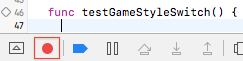]


这将在模拟器中以一种模式打开App，将您的交互记录为测试命令。 一旦App加载，点击游戏样式开关的*Slide* segment和顶部的TextField。 然后单击 Xcode 的Record 按钮停止录制。

在 `testGameStyleSwitch()`中有以下三行代码:

```swift
let app = XCUIApplication()
app.buttons["Slide"].tap()
app.staticTexts["Get as close as you can to: "].tap()
```

记录器已经创建了代码来测试你在App中测试的相同动作。 向 slider 和 label 发送一个点击。 您将使用这些语句作为基础来创建自己的 UI 测试。如果您看到其他任何语句，只需删除它们即可。

第一行与您在`setUp()`中创建的属性重复，因此请删除该行。您无需点击任何内容，因此也请在第2行和第3行的末尾删除`.tap()`。现在，打开`["Slide"]`旁边的小菜单，然后选择`segmentedControls.buttons["Slide"]`。

您剩下的应该是以下内容：

```swift
app.segmentedControls.buttons["Slide"]
app.staticTexts["Get as close as you can to: "]
```

点击任何其他对象，让记录器帮助您找到您可以在测试中访问的代码。 现在，用下面的代码替换这些行来创建一个*given* section:

```swift
// given
let slideButton = app.segmentedControls.buttons["Slide"]
let typeButton = app.segmentedControls.buttons["Type"]
let slideLabel = app.staticTexts["Get as close as you can to: "]
let typeLabel = app.staticTexts["Guess where the slider is: "]
```

现在您已经有了segmented control中两个button的名称以及两个可能的顶部标签，添加以下代码：

```swift
// then
if slideButton.isSelected {
  XCTAssertTrue(slideLabel.exists)
  XCTAssertFalse(typeLabel.exists)

  typeButton.tap()
  XCTAssertTrue(typeLabel.exists)
  XCTAssertFalse(slideLabel.exists)
} else if typeButton.isSelected {
  XCTAssertTrue(typeLabel.exists)
  XCTAssertFalse(slideLabel.exists)

  slideButton.tap()
  XCTAssertTrue(slideLabel.exists)
  XCTAssertFalse(typeLabel.exists)
}
```

这将检查在单击（`tap()`）分段控件中的每个按钮时是否存在正确的label。 运行测试ー所有断言都应该成功。

## 性能测试

根据[Apple的文档](https://developer.apple.com/library/prerelease/content/documentation/DeveloperTools/Conceptual/testing_with_xcode/chapters/04-writing_tests.html#//apple_ref/doc/uid/TP40014132-CH4-SW8)：*性能测试需要一块您要评估的代码块，并将其运行十次，收集平均执行时间和运行的标准差。这些单独测量值的平均值形成测试运行的值，然后可以将其与基准进行比较以评估成功或失败。*

编写性能测试非常简单：您只需将要测量的代码放入闭包`measure()`中。

要查看实际效果，请重新打开*HalfTunes*项目，并在*HalfTunesFakeTests.swift*中添加以下测试：

```swift
func test_StartDownload_Performance() {
  let track = Track(
    name: "Waterloo", 
    artist: "ABBA",
    previewUrl: 
      "http://a821.phobos.apple.com/us/r30/Music/d7/ba/ce/mzm.vsyjlsff.aac.p.m4a")

  measure {
    self.sut.startDownload(track)
  }
}
```

运行测试，然后单击`measure()`尾部闭包开头的图标以查看统计信息


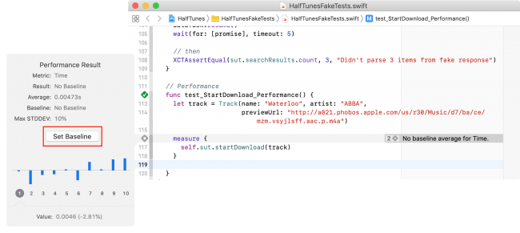

单击**Set Baseline**以设置参考时间。 然后，再次运行性能测试并查看结果ーー它可能比基线更好，也可能更糟。 **Edit**按钮允许您将基线重置为这个新结果。

基线（Baselines）是按设备配置存储的，所以你可以在几个不同的设备上执行相同的测试，并且根据特定配置的处理器速度、内存等维护不同的基线。

每当您对app进行更改而可能影响所测试方法的性能时，请再次运行性能测试以查看其与基准的比较情况。

## 代码覆盖率

代码覆盖率工具会告诉您测试实际上正在运行哪些app代码，因此您知道该app代码的哪些部分木有（尚未）进行测试。

要启用代码覆盖率，请**scheme**的 **Test** 操作并选中 **Options** 选项卡下的 **Gather coverage for** 复选框:

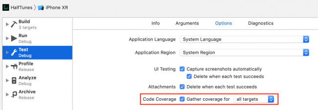

Run *all* tests (*Command-U*), then open the Report navigator (*Command-9*). Select *Coverage* under the top item in that list:

运行**全部的**测试（*Command-U*），然后打开 Report 导航器（*Command-9*）。选择该列表顶部项目下的*Coverage*：

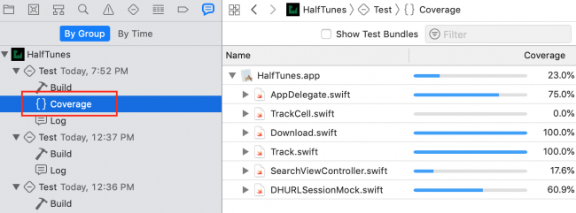

单击**展开三角（disclosure triangle）**以查看*SearchViewController.swift*中的函数和闭包列表：

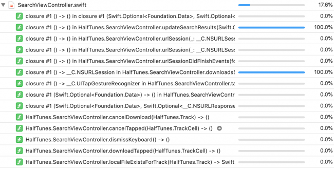

滑到 `updateSearchResults(_:)` 可以看到覆盖率是 87.9%.

单击此函数的箭头按钮，打开该函数的源文件。 当你把鼠标移到右边栏的覆盖注释上时，部分代码会突出显示绿色或红色:

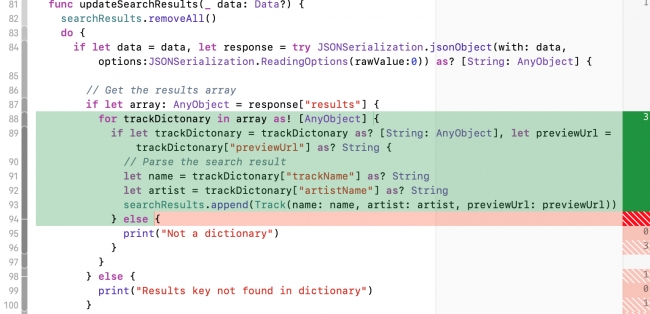

覆盖率注释显示测试命中每个代码段的次数；未调用的部分以红色突出显示。如您所料，for循环运行了3次，但红色错误路径中的任何内容均未执行。

为了扩大此功能的覆盖范围，您可以复制*abbaData.json*，然后对其进行编辑，以便引起不同的错误。例如，在一个测试中更改`"results"` 为 `"result"`会命中`print("Results key not found in dictionary")`。

### 100% 代码覆盖率?

努力争取100% 的代码覆盖率有多难？ Google搜索“100% unit test coverage”  ，你会发现一系列支持和反对这一点的论据，以及关于“100% coverage”.定义的争论。 反对意见认为，最后的10-15% 不值得付出努力。 支持它的论据说最后10-15% 是最重要的，因为它太难测试了。  Google搜索 “hard to unit test bad design” 以寻找有说服力的论据，证明[不可测试的代码是更深层次的原因在于设计问题](https://www.toptal.com/qa/how-to-write-testable-code-and-why-it-matters)。

## 接下来干点啥好

现在您可以使用一些很好的工具为项目编写测试。 我希望这个 iOS 单元测试和用户界面测试教程能给你测试所有东西的信心！

您可以使用本教程顶部或底部的 Download Materials 按钮下载项目的完整版本。 通过增加你自己的额外测试来继续发展你的技能。

以下是一些可供进一步研究的东东:

- 关于测试的主题有几个WWDC视频。WWDC17有两个不错的选择: [Engineering for Testability](https://developer.apple.com/videos/play/wwdc2017/414/) and [Testing Tips & Tricks](https://developer.apple.com/videos/play/wwdc2018/417/).
- 下一步是*自动化*：*持续集成*和*持续交付*。首先从Apple的Xcode Server和 `xcodebuild`开始： [Automating the Test Process](https://developer.apple.com/library/content/documentation/DeveloperTools/Conceptual/testing_with_xcode/chapters/08-automation.html#//apple_ref/doc/uid/TP40014132-CH7-SW1) ，然后是[Wikipedia的持续交付文章](https://en.wikipedia.org/wiki/Continuous_delivery)，该[文章](https://en.wikipedia.org/wiki/Continuous_delivery)借鉴了[ThoughtWorks的](https://www.thoughtworks.com/continuous-delivery)专业知识。
- 如果您已经有一个app但是还没有为它编写测试，则可能要参考 [*Working Effectively with Legacy Code* by Michael Feathers](https://www.amazon.com/Working-Effectively-Legacy-Michael-Feathers/dp/0131177052/ref=sr_1_1?s=books&ie=UTF8&qid=1481511568&sr=1-1), 因为没有测试*的*代码*是*旧版代码！
- 乔恩·里德（Jon Reid）的质量编码示例应用档案库非常适合了解有关[测试驱动开发（Test Driven Development ）的](http://qualitycoding.org/tdd-sample-archives/)更多信息。